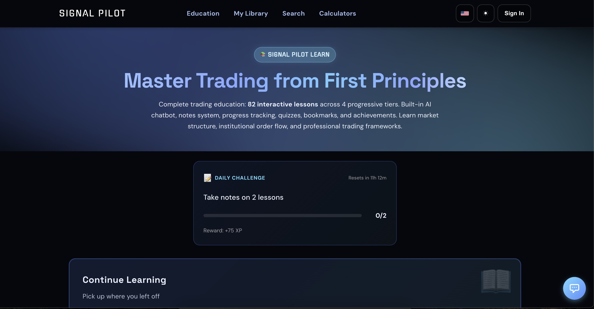

# 🎓 Signal Pilot Education Hub

## **"Beyond Retail Thinking"**

*We don't teach you to trade. We teach you to think like a market maker.*



[](https://discord.gg/5guVbGEyj8)

---

## 📊 Current Status (Updated 2025-10-30)

### ✅ **COMPLETE: 82 Professional Trading Lessons**

**250,000+ words** of comprehensive trading education across 4 tiers

| Tier | Lessons | Status | Word Count |
|------|---------|--------|------------|
| 🟢 **Beginner** | 20 | ✅ Complete | ~59,000 words |
| 🟡 **Intermediate** | 27 | ✅ Complete | ~84,000 words |
| 🔴 **Advanced** | 27 | ✅ Complete | ~77,000 words |
| ⚫ **Professional** | 8 | ✅ Complete | ~24,000 words |

**Total:** 82 interactive lessons with quizzes, progress tracking, and achievements

---

## 🚀 What's Inside

### 🟢 **Beginner Tier** (12 Lessons)
**Focus:** Unlearn retail lies, build professional foundation

**Core Topics:**
- Liquidity engineering & market structure
- Volume analysis & delta reading
- Order flow mechanics
- Indicator truth (repainting, RSI, MAs)
- Psychology (revenge trading, confirmation bias)
- Risk management (position sizing, stops)
- Multi-timeframe analysis
- Paper trading reality

**Key Lessons:**
1. The Liquidity Lie - How institutions hunt your stops
2. Volume Doesn't Lie - Delta, CVD, and absorption patterns
3. The Repaint Problem - Why 60-90% of indicators lie
4. RSI Extremes - Using RSI correctly (regime, not reversal)
5. Moving Averages - Death/Golden Cross vs. Pentarch IGN events
6. Revenge Trading - Breaking the tilt cycle
7. Confirmation Bias - The falsification mindset
8. Position Sizing - Structure-based risk, not percentages
9. Stop Losses - Why retail stops get hunted
10. Timeframe Illusion - HTF bias, MTF structure, LTF timing
11. Paper Trading - Why sim results don't transfer to live
12. Spread Dynamics - Bid-ask mechanics

---

### 🟡 **Intermediate Tier** (15 Lessons)
**Focus:** Systems over signals - Build systematic edge

**Core Topics:**
- Market microstructure (bid-ask, order book, market making, HFT)
- Advanced order flow (footprint charts, dark pools, smart money divergence)
- Multi-timeframe mastery
- Signal Pilot indicators (Janus Atlas, Plutus Flow, Volume Oracle)
- Regime detection & portfolio construction
- Backtesting methodology
- Trade journal mastery
- Professional operations

**Key Lessons:**
13. Bid-Ask Spread Dynamics
14. Order Book Analysis
15. Market Making & HFT
16. Footprint Charts
17. Dark Pools
18. Smart Money Divergence
19. Multi-Timeframe Mastery
20. Janus Atlas Advanced
21. Plutus Flow Mastery
22. Volume Oracle Regimes
23. Portfolio Construction
24. Backtesting Reality
25. Trade Journal Mastery
26. Professional Operations

---

### 🔴 **Advanced Tier** (15 Lessons)
**Focus:** Probabilistic thinking - How professionals trade

**Core Topics:**
- Institutional order flow (iceberg orders, block trades)
- Market regime recognition
- Auction theory & fair value gaps
- Cross-asset correlations
- Option flow & skew
- Principal component analysis
- Machine learning foundations
- Trading automation & APIs
- Portfolio theory
- Professional infrastructure
- Behavioral finance

**Key Lessons:**
28. Institutional Order Flow
29. Market Regime Recognition
30. Auction Theory Advanced
31. Cross-Asset Correlations
32. Statistical Arbitrage
33. Options Flow & Skew
34. Advanced Risk Management
35. Portfolio Theory Advanced
36. High-Frequency Concepts
37. Trading Automation & APIs
38. Principal Component Analysis
39. Machine Learning Foundations
40. Behavioral Finance Advanced
41. Professional Infrastructure
42. Meta-Learning & Mastery

---

## 📚 Additional Resources

### ✅ **Comprehensive Documentation**

**Pentarch System Reference** (`resources/pentarch-complete-reference.md`)
- Complete documentation of all 8 Pentarch components
- 5 Event Signals: TD, IGN, CAP, WRN, BDN
- 3 Supporting Components: Pilot Line, Regime Bar Colors, NanoFlow
- Integration examples and cycle-phase analysis
- Compliance-safe language (observational, educational, conditional)

**Trading Checklists** (`resources/checklists/`)
- Liquidity Sweep Checklist
- Dark Pool Analysis Checklist
- Footprint Reading Checklist
- Multi-Timeframe Framework
- Smart Money Divergence Checklist
- Regime Recognition Checklist

**Templates** (`resources/templates/`)
- Trade Journal Template
- Position Sizing Calculator
- Risk Management Template

**Interactive Tools**
- Professional calculators (position sizing, risk/reward, Sharpe ratio)
- Search functionality across all 42 lessons
- Progress tracking with achievements

---

## 🎯 Quick Start Guide

### **Step 1: Choose Your Path**

**New to Trading?** → Start with Beginner Lesson #1
**Experienced Trader?** → Jump to Intermediate Tier
**Professional?** → Explore Advanced Tier

### **Step 2: Access the Education Hub**

**Live Site:** `https://education.signalpilot.io/`

**Local Development:**
```bash
# Clone the repository
git clone https://github.com/signalpilot/signalpilot-education-hub.git

# Open index.html in browser
cd signalpilot-education-hub
open index.html  # macOS
start index.html # Windows
xdg-open index.html # Linux
```

### **Step 3: Progress Sequentially**

✅ Don't skip lessons (each builds on previous)
✅ Complete quizzes to test understanding
✅ Use checklists and templates
✅ Track progress with built-in system

### **Step 4: Install Signal Pilot Indicators**

**Core Indicators:**
- **Janus Atlas** - Liquidity sweep detection
- **Plutus Flow** - Volume analysis & delta reading
- **Volume Oracle** - Regime detection & market structure
- **Harmonic Oscillator** - Timing & momentum
- **Pentarch** - Complete 8-component cycle-phase system

### **Step 5: Practice & Apply**

- Paper trade each concept before combining
- Journal using provided templates
- Join Signal Pilot community for feedback

---

## 📂 Repository Structure

```
signalpilot-education-hub/
│
├── curriculum/                          # 42 interactive lessons
│   ├── beginner/                        # 12 lessons (31,000 words)
│   │   ├── 01-the-liquidity-lie-enhanced.html
│   │   ├── 02-volume-doesnt-lie.html
│   │   └── ... (10 more)
│   │
│   ├── intermediate/                    # 15 lessons (42,000 words)
│   │   ├── 13-bid-ask-spread-dynamics.html
│   │   ├── 14-order-book-analysis.html
│   │   └── ... (13 more)
│   │
│   └── advanced/                        # 15 lessons (37,000 words)
│       ├── 28-institutional-order-flow.html
│       ├── 29-market-regime-recognition.html
│       └── ... (13 more)
│
├── resources/                           # Checklists, templates, docs
│   ├── pentarch-complete-reference.md   # 8-component Pentarch system
│   ├── checklists/                      # 6 professional checklists
│   └── templates/                       # Trade journal, calculators
│
├── assets/                              # Styles, scripts, fonts
│   ├── edu.css                          # Education hub styles
│   ├── signalpilot-theme.css            # Theme system
│   └── sp-*.js                          # Interactive components
│
├── index.html                           # Main landing page
├── beginner.html                        # Beginner tier overview
├── intermediate.html                    # Intermediate tier overview
├── advanced.html                        # Advanced tier overview
├── resources.html                       # Resources & downloads
├── search.html                          # Search all lessons
├── calculators.html                     # Trading calculators
│
├── COMPLIANCE_GUIDELINES.md             # Content compliance standards
├── VISUAL_HIERARCHY_ASSESSMENT.md       # UI/UX analysis
└── README.md                            # This file
```

---

## 🎨 Features

### **Interactive Learning**
- ✅ Quizzes with instant feedback
- ✅ Progress tracking across all lessons
- ✅ Achievement badges
- ✅ Continue reading functionality
- ✅ Responsive design (desktop & mobile)

### **Professional Design**
- ✅ Dark/light theme support
- ✅ Gradient typography
- ✅ Clear visual hierarchy
- ✅ Professional callout boxes (info, warning, tip, key)
- ✅ Interactive tabs and accordions
- ✅ Smooth animations and transitions

### **Search & Navigation**
- ✅ Full-text search across all 42 lessons
- ✅ Breadcrumb navigation
- ✅ Table of contents on long articles
- ✅ Related lesson suggestions
- ✅ Progress indicators

---

## 🛠️ Recent Updates

### **2025-10-30: Visual Hierarchy Improvements**
- Fixed breadcrumb wrapping issue (now stays on one line)
- Improved heading scale (H2: 2.25rem, H3: 1.75rem, H4: 1.4rem)
- Enhanced badge visibility with glow effects
- Standardized logo across all pages
- Improved search prominence
- Better card hover states
- Cache-busting for CSS updates

### **2025-10-29: Comprehensive Compliance Update**
- Replaced 200+ instances of certainty language
- Changed "confirms/confirmed" → "indicates/indicated"
- Removed "perfect/exact/precision" language
- Eliminated directive language ("Look for", "must", "should")
- Updated financial advice language ("your trade" → "a trade")
- All content now observational, educational, conditional

### **2025-10-29: Pentarch Documentation**
- Added complete 8-component Pentarch reference
- Documented Pilot Line, Regime Bar Colors, NanoFlow
- Integration examples and cycle-phase analysis
- Compliance-safe language throughout

---

## ⚖️ Compliance & Disclaimers

### **Educational Content Only**
This education hub provides educational content about trading concepts, market structure, and technical analysis. **This is not financial advice.** All content is for educational and informational purposes only.

### **Risk Disclosure**
Trading involves substantial risk of loss. Past performance is not indicative of future results. All examples and case studies are for educational illustration only.

### **Language Standards**
All content uses:
- **Observational language** ("shows", "indicates", "appears")
- **Educational language** ("context", "data", "typically associated with")
- **Conditional language** ("can indicate", "may suggest", "potential")

Zero instances of:
- Directive language ("must", "should", "Look for")
- Certainty claims ("confirms", "guarantees", "always")
- Perfection language ("perfect", "exact", "precision")
- Direct financial advice ("your trade", "buy", "sell")

See `COMPLIANCE_GUIDELINES.md` for full standards.

---

## 🤝 Contributing

This is the official Signal Pilot education repository. Content is created by the Signal Pilot team.

**Feedback Welcome:**
- Report issues: Use GitHub issues
- Suggest improvements: Pull requests accepted
- Join discussion: Signal Pilot Discord community

---

## 📜 License

© 2025 Signal Pilot. All rights reserved.

Content is proprietary and provided for educational use by Signal Pilot subscribers and community members.

---

## 🔗 Links

- **Education Hub:** https://education.signalpilot.io/
- **Main Website:** https://signalpilot.io/
- **Pricing:** https://signalpilot.io/#pricing
- **Documentation:** https://docs.signalpilot.io/
- **Discord Community:** [Join Discord](https://discord.gg/5guVbGEyj8)

---

## 📞 Support

Questions about the education content?
- Check lesson-specific Q&A sections
- Search the knowledge base
- Ask in Discord community
- Email: support@signalpilot.io

---

*"The market doesn't owe you profits. But if you learn its language, it will speak clearly."*

**— Signal Pilot Education Team**
